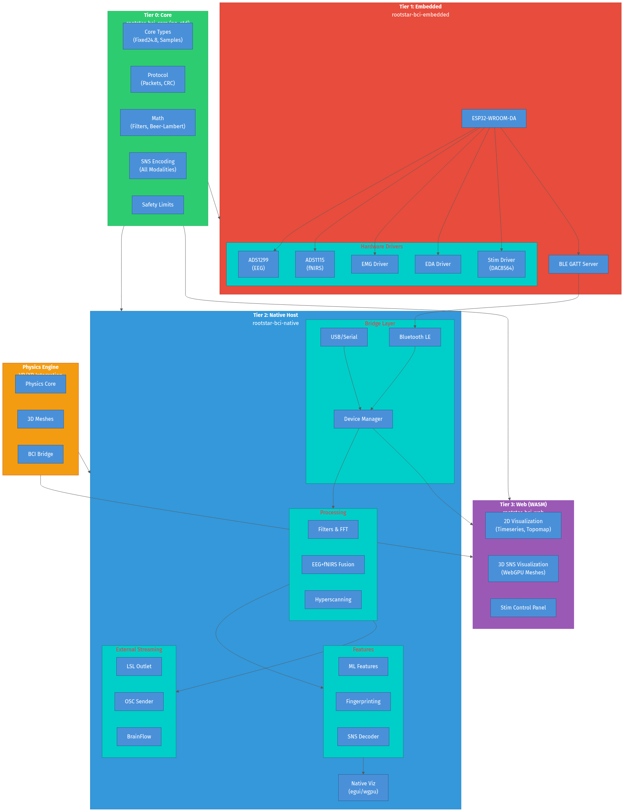
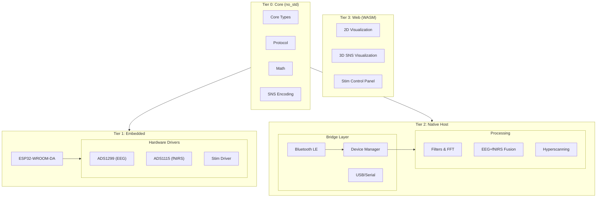
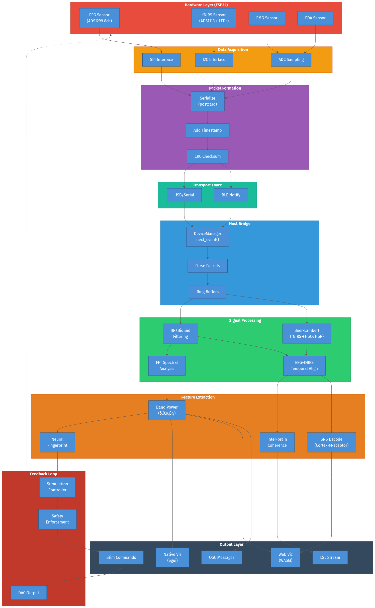
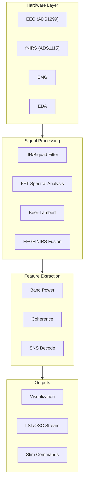
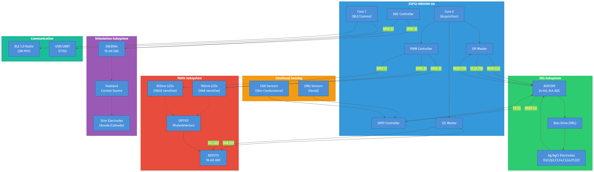
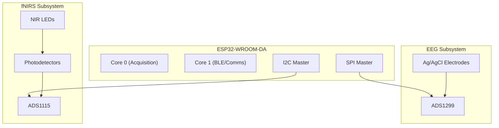
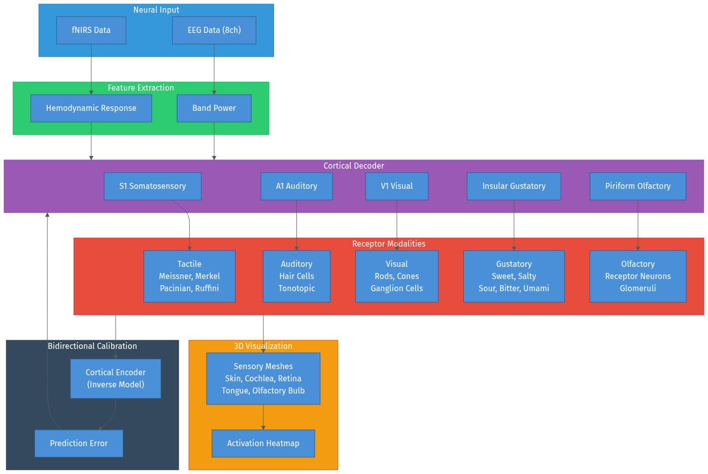
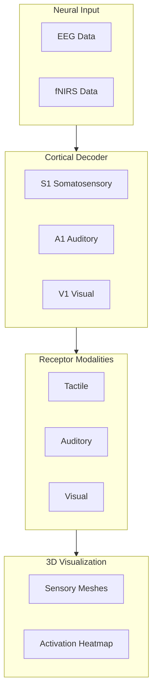
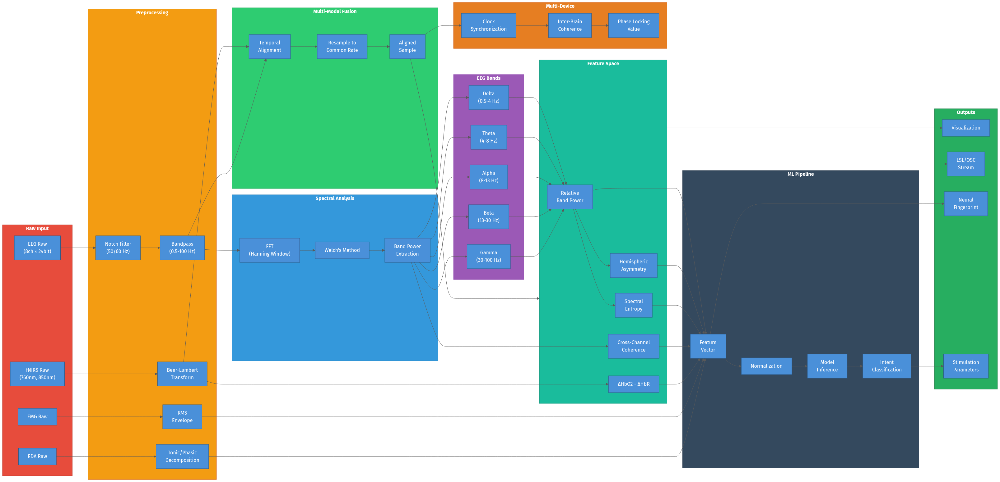

# Rootstar BCI Architecture

This document provides visual architecture diagrams for the Rootstar BCI platform.

## Table of Contents

- [System Architecture Overview](#system-architecture-overview)
- [Data Flow](#data-flow)
- [Hardware Interface](#hardware-interface)
- [Sensory Neural Simulation (SNS)](#sensory-neural-simulation-sns)
- [Processing Pipeline](#processing-pipeline)

---

## System Architecture Overview

The platform uses a 4-tier architecture with a physics engine for VR/XR integration:

**Tier Descriptions:**

| Tier | Crate | Description |
|------|-------|-------------|
| **Tier 0** | `rootstar-bci-core` | `no_std` compatible foundation with core types (Fixed24.8, samples), protocol definitions, math utilities (filters, Beer-Lambert), and SNS encoding |
| **Tier 1** | `rootstar-bci-embedded` | ESP32 firmware with hardware drivers for ADS1299 (EEG), ADS1115 (fNIRS), EMG, EDA, and neurostimulation |
| **Tier 2** | `rootstar-bci-native` | Host-side processing including device management, signal processing, ML features, fingerprinting, and native visualization |
| **Tier 3** | `rootstar-bci-web` | WASM-based web interface with 2D/3D visualization using Leptos and WebGPU |
| **Physics** | `rootstar-physics-*` | VR/XR integration with haptic feedback, 3D meshes, and game engine API |

View Mermaid Source

---

## Data Flow

Complete data flow from hardware sensors through processing to visualization:

**Flow Stages:**

1. **Hardware Layer**: Raw sensor data from EEG (ADS1299), fNIRS (ADS1115), EMG, and EDA
2. **Data Acquisition**: SPI/I2C sampling with interrupt-driven data ready
3. **Packet Formation**: Serialization with postcard, timestamping, and CRC checksum
4. **Transport**: USB/Serial or BLE notifications to host
5. **Host Bridge**: DeviceManager async event loop with ring buffers
6. **Signal Processing**: Filtering, FFT, Beer-Lambert transform, fusion
7. **Feature Extraction**: Band power, coherence, SNS decoding, fingerprinting
8. **Output**: Visualization, LSL/OSC streaming, stimulation commands

View Mermaid Source

---

## Hardware Interface

ESP32 connections to all sensors and peripherals:

**Pin Assignments:**

| Interface | GPIO Pins | Connected Hardware |
|-----------|-----------|-------------------|
| **SPI** | MOSI=23, MISO=19, SCLK=18, CS=5, DRDY=4 | ADS1299 (EEG) |
| **I2C** | SDA=21, SCL=22 | ADS1115 (fNIRS ADC) |
| **PWM** | 25, 26, 27 | NIR LEDs (760nm, 850nm) |
| **DAC** | 32, 33 | DAC8564 (Stimulation) |

**Subsystems:**

- **EEG Subsystem**: TI ADS1299 24-bit 8-channel ADC with bias drive (DRL) for common-mode rejection
- **fNIRS Subsystem**: ADS1115 16-bit ADC with dual-wavelength LEDs (760nm/850nm) and OPT101 photodetectors
- **Stimulation Subsystem**: DAC8564 with Howland current source topology
- **Communication**: Dual-core ESP32 with BLE 5.0 and USB/UART

View Mermaid Source

---

## Sensory Neural Simulation (SNS)

Bidirectional mapping between neural signals and sensory experiences:

**SNS Modalities:**

| Modality | Cortical Area | Receptors | Visualization |
|----------|---------------|-----------|---------------|
| **Tactile** | S1 Somatosensory | Meissner, Merkel, Pacinian, Ruffini | Skin mesh |
| **Auditory** | A1 Auditory | Inner/outer hair cells | Cochlea mesh |
| **Visual** | V1 Visual | Rods, cones, ganglion cells | Retina mesh |
| **Gustatory** | Insular | Taste buds (5 types) | Tongue mesh |
| **Olfactory** | Piriform | Receptor neurons, glomeruli | Olfactory bulb |

**Processing Flow:**

1. **Neural Input**: EEG (8ch) and fNIRS data
2. **Feature Extraction**: Band power and hemodynamic response
3. **Cortical Decoder**: Maps features to modality-specific cortical areas
4. **Receptor Activation**: Simulates specific receptor types for each modality
5. **3D Visualization**: Renders activation patterns on anatomical meshes
6. **Bidirectional Calibration**: Encoder generates predicted signals for error minimization

View Mermaid Source

---

## Processing Pipeline

Complete signal processing chain from raw input to ML inference:

**Processing Stages:**

| Stage | Operations | Output |
|-------|------------|--------|
| **Preprocessing** | Notch filter (50/60Hz), Bandpass (0.5-100Hz), Beer-Lambert | Clean signals, HbO/HbR |
| **Spectral Analysis** | FFT with Hanning window, Welch's method | Power spectral density |
| **Band Extraction** | Delta (0.5-4Hz), Theta (4-8Hz), Alpha (8-13Hz), Beta (13-30Hz), Gamma (30-100Hz) | Band power values |
| **Fusion** | Temporal alignment, resampling | Aligned multi-modal samples |
| **Features** | Relative power, asymmetry, entropy, coherence | Feature vectors |
| **Multi-Device** | Clock sync, inter-brain coherence, PLV | Hyperscanning metrics |
| **ML Pipeline** | Normalization, inference | Intent classification |

```mermaid
flowchart LR
    subgraph Input["Raw Input"]
        EEGRaw["EEG Raw"]
        FNIRSRaw["fNIRS Raw"]
    end

    subgraph Preproc["Preprocessing"]
        Notch["Notch Filter"]
        Bandpass["Bandpass"]
        BeerLambert["Beer-Lambert"]
    end

    subgraph Spectral["Spectral Analysis"]
        FFT["FFT"]
        Bands["Band Power"]
    end

    subgraph Features["Feature Space"]
        Power["Band Power"]
        Coherence["Coherence"]
    end

    subgraph Output["Outputs"]
        Viz["Visualization"]
        ML["ML Inference"]
    end

    Input --> Preproc --> Spectral --> Features --> Output
```

View Mermaid Source

---

## Diagram Sources

The original Mermaid diagram source files are available in [docs/diagrams/](diagrams/):

- `01-system-architecture.mmd` - 4-tier system architecture
- `02-data-flow.mmd` - Complete data flow
- `03-hardware-interface.mmd` - ESP32 hardware connections
- `04-sns-architecture.mmd` - SNS bidirectional mapping
- `05-processing-pipeline.mmd` - Signal processing chain

These can be edited and regenerated using the [Mermaid CLI](https://github.com/mermaid-js/mermaid-cli) or [Kroki](https://kroki.io/).
